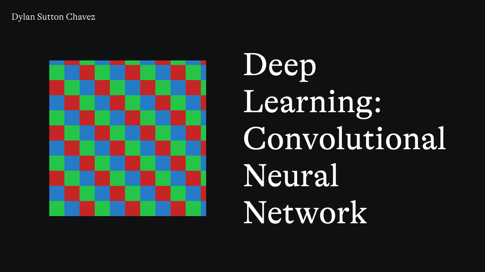

# Deep Learning; Convolutional Neural Network

## Description

This project implements a **Convolutional Neural Network (CNN)** to perform character recognition using the **EMNIST** dataset. The model is trained to classify handwritten letters and digits into 62 different categories (digits 0-9, uppercase A-Z, and lowercase a-z).

The trained CNN model is capable of taking an image of a handwritten character and predicting its corresponding class.

## What is a Convolutional Neural Network (CNN)?

A **Convolutional Neural Network** (CNN) is a deep learning algorithm primarily used for processing grid-like data such as images. CNNs are designed to automatically and adaptively learn spatial hierarchies of features through layers of convolutions and pooling. The key layers in CNNs include:

1. **Convolutional Layers**: These layers apply convolutional filters to the input image to extract features such as edges and textures.
2. **Activation Function**: After convolution, the activation function (typically ReLU) introduces non-linearity, helping the network to learn complex patterns.
3. **Pooling Layers**: Pooling layers downsample the image to reduce its spatial dimensions, retaining important features and reducing computational complexity.
4. **Fully Connected Layers**: After feature extraction, the fully connected layers classify the features into specific categories.

### How It Works

The model works by processing images of characters through the CNN to extract relevant features, such as edges and patterns, and using them to make a final prediction. The image is first resized to 28x28 pixels, normalized, and converted to a tensor before being passed through the network.

The model is trained on the **EMNIST** dataset, which contains both handwritten digits and letters. During training, the CNN learns to identify complex features of each character by using convolutions, pooling, and fully connected layers.

### Training the Model

The CNN is trained on the EMNIST dataset using **backpropagation** and the **Adam optimizer**. The model learns the weights of the filters and fully connected layers iteratively to minimize the classification error.

### Early Stopping

To prevent overfitting, the training process includes **early stopping**. This technique halts training if the validation loss does not improve after a set number of epochs, ensuring the model does not overfit to the training data.

## Project Features

- **Data Preprocessing**: The input image is resized, converted to grayscale, and normalized before being passed through the CNN.
- **CNN Architecture**: A deep learning model consisting of convolutional layers, pooling layers, and fully connected layers for character recognition.
- **Training**: The model is trained on the EMNIST dataset with early stopping to prevent overfitting.
- **Trained Model**: The final model is saved in a 'emnistModel.pkl' file for later use.
- **Inference**: The trained model can be used to predict the class of a new character image.
- **Prediction**: Given an input image of a handwritten letter or digit, the model predicts the corresponding character.

## Requirements

- **Python 3.x**
- **torch**
- **torchvision**
- **pandas**
- **numpy**
- **Pillow**

## To Run the Training:

1. **Install Dependencies**  
   Run the following command in your terminal: 'pip install -r requirements.txt'

2. **Install Dataset**  
   Search Kaggle for the EMNIST dataset and download the training and test sets in '.csv' format

3. **Run the Training**  
   Start the training: 'python trainConvultional.py'

## To Run Inference:

1. **Install Dependencies**  
   Run the following command in your terminal: 'pip install -r requirements.txt'

2. **Run Inference**  
   Execute inference: 'python inferenceConvultional.py'
